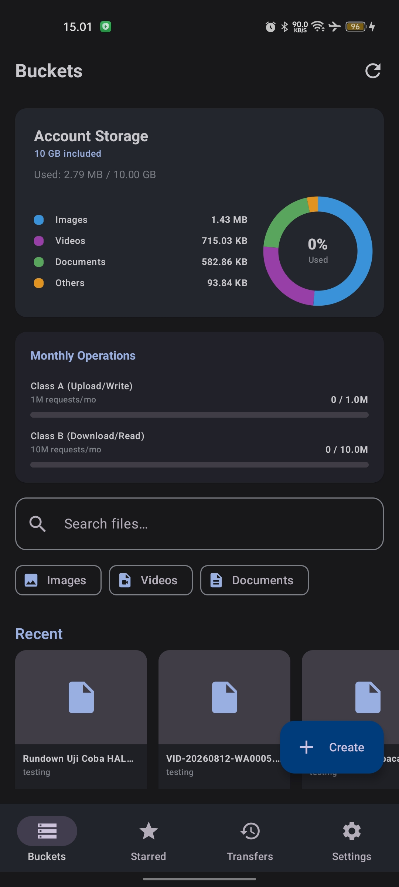
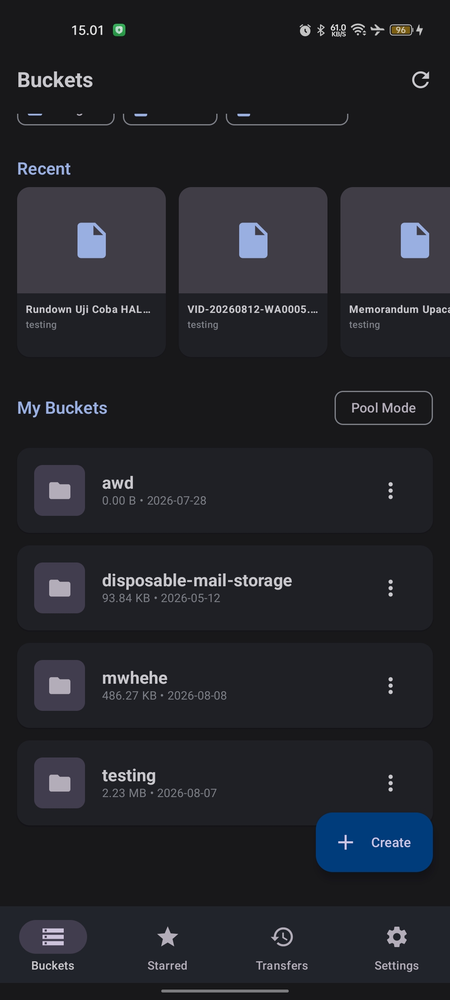
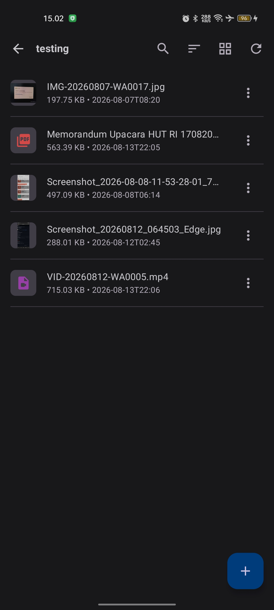
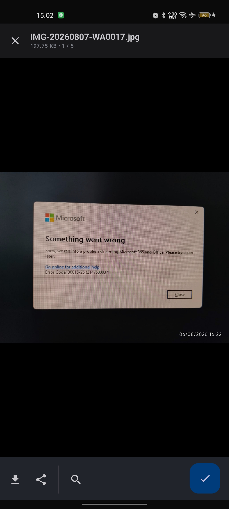
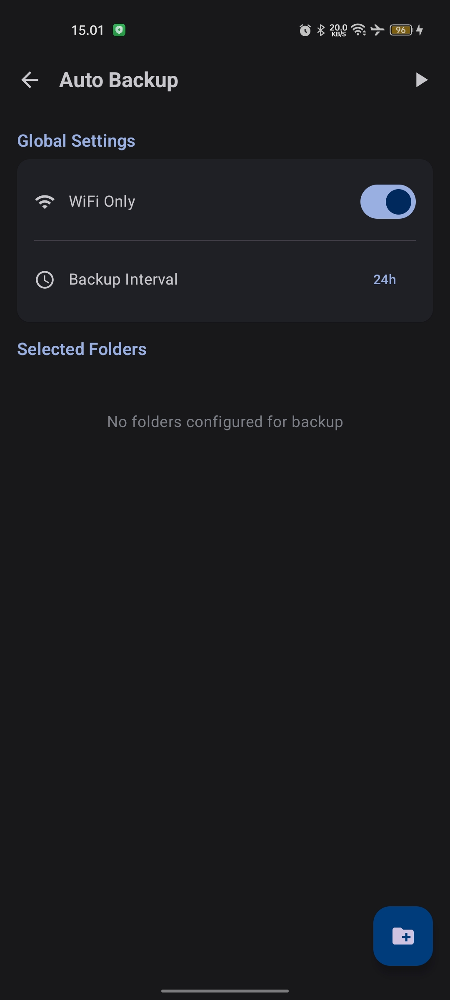
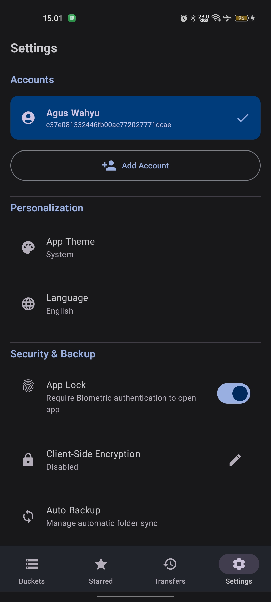

# Awd R2Cloud Android ☁️🚀

<p align="center">
  
</p>

<p align="center">
  <a href="https://github.com/putuwahyu29/awd-r2cloud-android/blob/main/LICENSE">
    
  </a>
  
  
  
  
</p>

**Awd R2Cloud Android** is a professional, secure, and feature-rich cloud storage client for Cloudflare R2. Manage your buckets, automate background backups, and navigate your files through a modern Material 3 interface. Built with a focus on privacy, performance, and seamless user experience.

---

## 🌐 Language / Bahasa
*   [English Version (Main)](README.md)
*   [Versi Bahasa Indonesia](README.id.md)

---

## 📌 Table of Contents
- [✨ Key Features](#-key-features)
- [📷 Screenshots](#-screenshots)
- [📁 Storage & Security](#-storage--security)
- [🚀 Getting Started](#-getting-started)
- [🛠️ Developer Guide](#️-developer-guide)
- [⚠️ Disclaimer](#️-disclaimer)
- [📄 License](#-license)

---

## ✨ Key Features

*   **☁️ Cloudflare R2 Integration**: Native support for S3-compatible R2 storage. Manage multiple accounts seamlessly.
*   **🔍 Global Search & Filtering**: Find files across all buckets instantly. Filter by category: Images, Videos, or Documents.
*   **🔄 Auto Backup Service**: Synchronize local folders to specific R2 buckets in the background using Android WorkManager.
*   **🔒 Client-Side Encryption**: Optional AES-256 encryption. Your files are encrypted before leaving your device.
*   **📊 Usage Monitoring**: Real-time tracking of storage capacity and monthly Class A/B operations.
*   **🎨 Material 3 Design**: Clean, modern interface with full Dark/Light mode support and localized strings (EN/ID).

---

## 📷 Screenshots

<p align="center">
  
  
  
</p>
<p align="center">
  
  
  
</p>

---

## 📁 Storage & Security

*   **Secure Credentials**: All API keys and tokens are stored using Android's `EncryptedSharedPreferences` (AES-256).
*   **Biometric Lock**: Optional app protection using Fingerprint or Face ID.
*   **Private Data**: The app communicates directly with Cloudflare endpoints. No data is sent to third-party servers.

---

## 🚀 Getting Started

### Prerequisites
*   A Cloudflare account with R2 enabled.
*   Android device running Android 8.0 (API 26) or higher.

### Obtaining Credentials
To use this app, you need:
1. **Account ID**: Found in your Cloudflare Dashboard (R2 overview).
2. **Access Key ID & Secret Access Key**: Generate these in R2 -> Manage R2 API Tokens.
3. **API Token (Optional)**: Required for viewing usage statistics and managing public domains.

---

## 🛠️ Developer Guide

### Project Structure
```
awd-r2cloud/
├── app/                    # Core Android App Module
│   ├── src/
│   │   ├── main/
│   │   │   ├── java/com/awd/r2cloud/
│   │   │   │   ├── data/        # Data layer (Repository, Local, Remote)
│   │   │   │   ├── domain/      # Domain layer (Models, Repository interfaces)
│   │   │   │   ├── ui/          # UI layer (Compose screens, ViewModels)
│   │   │   │   └── security/    # Encryption logic
│   │   │   └── AndroidManifest.xml
└── .github/workflows       # CI/CD Workflows
```

### Building
```bash
./gradlew assembleDebug
```

---

## ⚠️ Disclaimer

This project is an independent development and is not affiliated with Cloudflare. Users are responsible for their usage costs and compliance with Cloudflare's Terms of Service.

---

## 📄 License

MIT License. See [LICENSE](LICENSE) for details.

<p align="center">Made with ❤️ by <a href="mailto:aguswahyu@office.awd.my.id">I Putu Agus Wahyu Dupayana</a></p>
